# PRÁCTICA DE LABORATORIO 

## CARRERA: Computación	ASIGNATURA: Programación Hipermedial
### NRO. PRÁCTICA:	8	
### TÍTULO PRÁCTICA: Desarrollo de una aplicación de realidad virtual usando la herramienta Unity y desplegada en un dispositivo móvil Android.
## OBJETIVO ALCANZADO:
- Experimentar con aplicaciones de realidad virtual.
- Experimentar con aplicaciones de realidad aumentada.
- Distinguir la diferencia entre tecnologías de realidad virtual y realidad aumentada.
# ACTIVIDADES DESARROLLADAS
## 1.	Desarrollo de los requerimientos.

### a.	Crear la GVR Camera Rig.

Se agregó a la escena el prefab GvrEditorEmulator a la escena, al igual que el objeto Main Camera, se le asignó como hijo. 

### b.	Preparando la escena para la interacción.

Se agregó el prefab GvrReticlePointer a la escena como elemento secundario del objeto MainCamera, junto con el prefab GvrEventSystem a la escena principal.

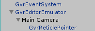

Se aumentó la distancia de la retícula de 10 a 20.

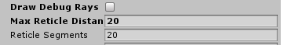 

### c.	Hacer que los objetos del juego sean interactivos

Se realizaron las configuraciones de los objetos Coin, Key y Door, con sus respectivos EventTrigger y Scripts con sus funciones adecuadas.

- Coin:
 
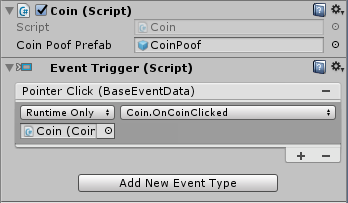

- Key:
 
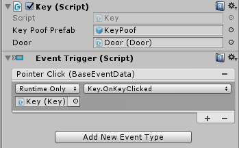

- Door:
 
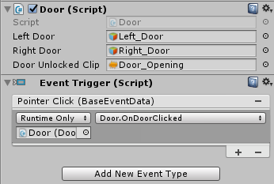

### d.	Hacer la interfaz de usuario interactiva

Se realizaron las asignaciones de Scripts necesarios para que el elemento GVR pueda interactuar con el objeto SignPost. También, se configuró EventTrigger con el respectivo Script.

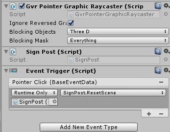

Funciones:

Función para crear el prefap CoinPoof, llamado por la función OnCoinClicked.
 
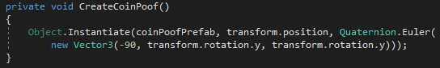

Función para la animación del objeto Coin, se optó por un efecto de levitación, haciendo uso de la función Seno y manipulación de la posición en el eje 

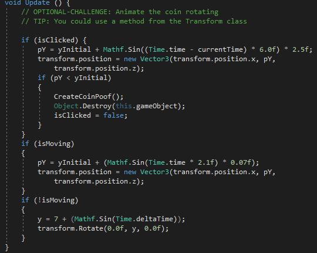

### e.	Programando el comportamiento de la llave (key).

Se realizaron las funciones respectivas en el Script del objeto Key.

Creación del prefab KeyPoof, llamado por la función OnKeyClicked.

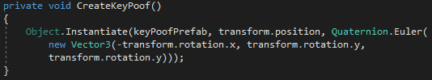 

Animación del objeto Key. Se optó por un efecto de rotación, para el cual, se manipuló el eje z.
 
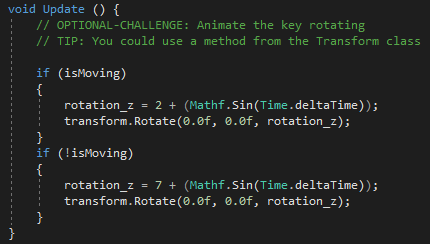 

### f.	Programando el comportamiento de la puerta (door).

Se realizaron las funciones respectivas en el Script del objeto Door.

Asignación de valores para la rotación de las puertas.

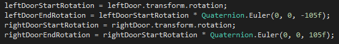  

Función para realizar la animación de girar las puertas.

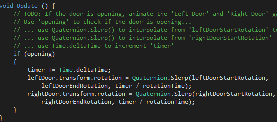 

### g.	Programando el comportamiento del SignPost.

Se programó el Script asignado al objeto prefab SignPost.

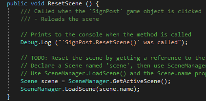 

## 2.	La evidencia del correcto diseño de la escena.

### a. Crear la funcionalidad del juego.
Se estructuró el siguiente laberinto:

Parte izquierda, el punto señalado es la posición de la cámara.

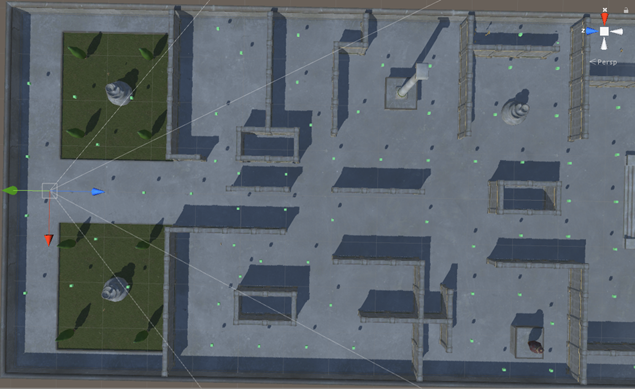 
 
Parte derecha, la parte señalada es la ubicación de la llave.
 
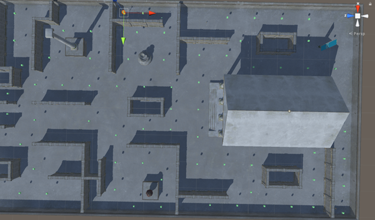 
 
En total se colocaron 14 monedas alrededor del mapa.

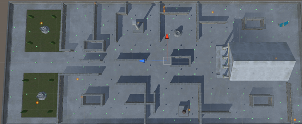 

## 3.	La evidencia del correcto funcionamiento de la aplicación.

Captura desde un dispositivo Android.
 
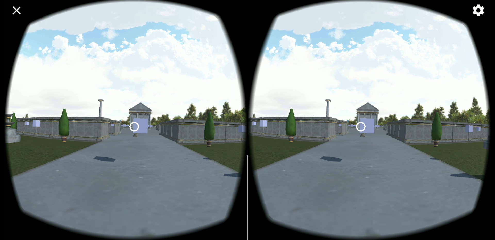
 
 
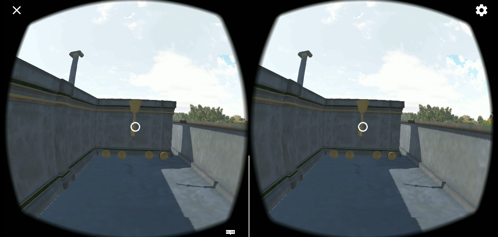 
 
Video de la ejecución del juego.

Enlace: https://youtu.be/Zk8jQSH6AJQ

## 4.	Incluir la información de GitHub (usuario y URL del repositorio de la práctica)

Nombre de usuario: czhizhpon

Enlace: https://github.com/czhizhpon/Practica08-LaberintoVR.git

## RESULTADO(S) OBTENIDO(S):
Se experimentó con aplicaciones de realidad virtual al realizar un juego de laberinto. Se experimentó con aplicaciones de realidad aumentada al diseñar conceptos abstraídos de la realidad, con el objetivo de distingue la diferencia entre ellos.

## CONCLUSIONES:
Cuando se habla de Realidad Virtual y Realidad Aumentada, tenemos dos conceptos familiares pero algunas diferencias. Sin embargo, los dos comparten que el resultado final va dirigido a un usuario. Al tratarse de una persona, se debe tener en consideración factores como elección de colores, la luz, la cantidad de objetos. Esto, con el objetivo de que la experiencia final, sea de agrado y que se puede usar la aplicación con normalidad con el mayor tiempo prolongado posible, garantizando el entretenimiento al usuario final.

## RECOMENDACIONES:
Leer la documentación que ofrece Unity.

*Nombre de estudiante:* Zhizhpon Tacuri Cesar Eduardo

*Firma de estudiante:* 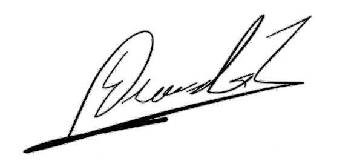 

